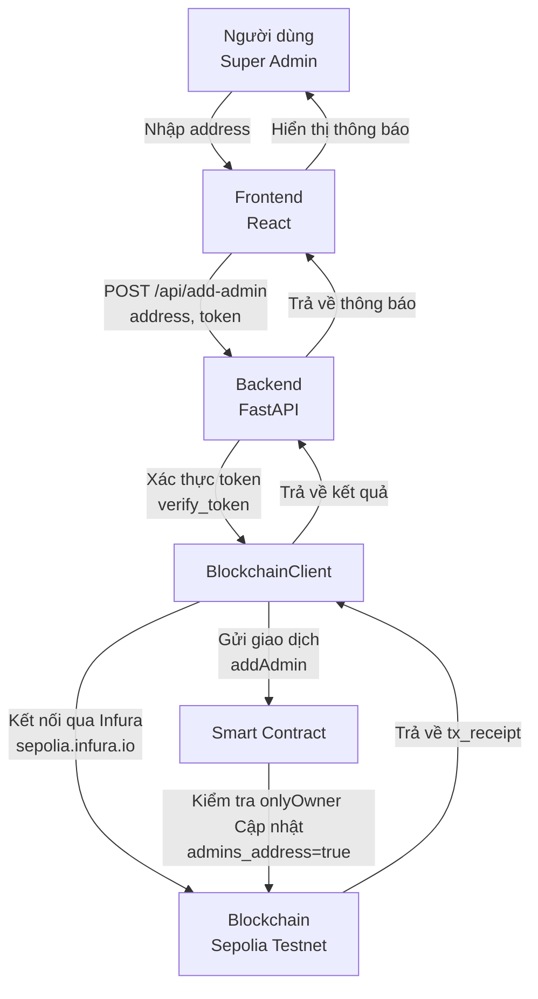

```mermaid
graph TD
    A[Người dùng <br> Super Admin] -->|Nhập address| B[Frontend <br> React]
    B -->|POST /api/add-admin <br> address, token| C[Backend <br> FastAPI]
    C -->|Xác thực token <br> verify_token| E[BlockchainClient]
    E -->|Kết nối qua Infura <br> sepolia.infura.io| I[Blockchain <br> Sepolia Testnet]
    E -->|Gửi giao dịch <br> addAdmin| H[Smart Contract]
    H -->|Kiểm tra onlyOwner <br> Cập nhật admins_address=true| I
    I -->|Trả về tx_receipt| E
    E -->|Trả về kết quả| C
    C -->|Trả về thông báo| B
    B -->|Hiển thị thông báo| A
```