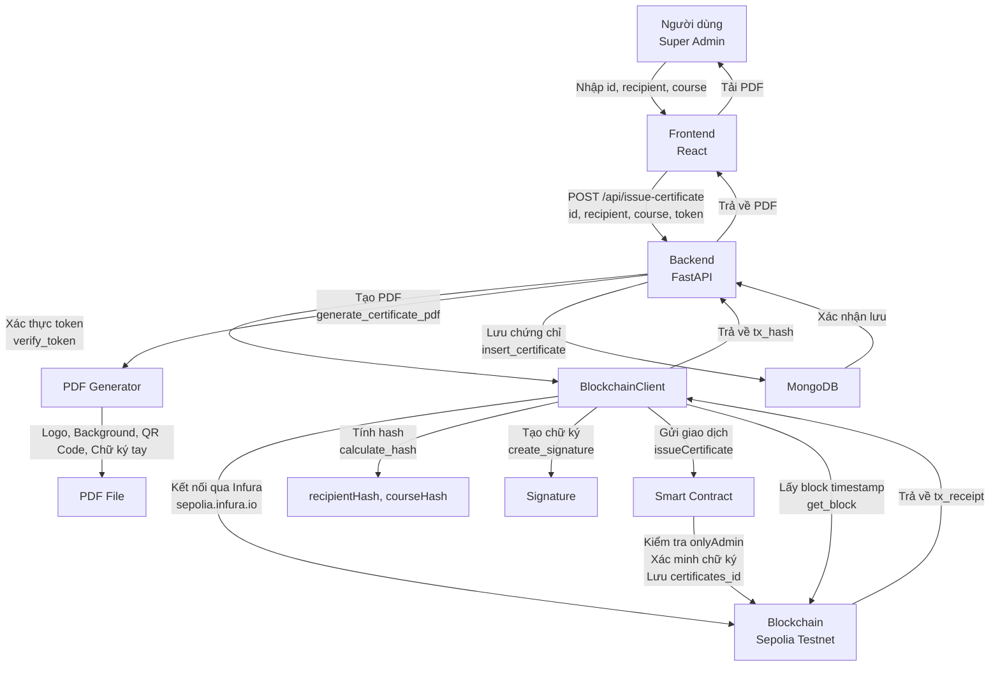

```mermaid
graph TD
    A[Người dùng <br> Super Admin] -->|Nhập id, recipient, course| B[Frontend <br> React]
    B -->|POST /api/issue-certificate <br> id, recipient, course, token| C[Backend <br> FastAPI]
    C -->|Xác thực token <br> verify_token| E[BlockchainClient]
    E -->|Kết nối qua Infura <br> sepolia.infura.io| I[Blockchain <br> Sepolia Testnet]
    E -->|Tính hash <br> calculate_hash| F[recipientHash, courseHash]
    E -->|Tạo chữ ký <br> create_signature| G[Signature]
    E -->|Gửi giao dịch <br> issueCertificate| H[Smart Contract]
    H -->|Kiểm tra onlyAdmin <br> Xác minh chữ ký <br> Lưu certificates_id| I
    I -->|Trả về tx_receipt| E
    E -->|Lấy block timestamp <br> get_block| I
    E -->|Trả về tx_hash| C
    C -->|Tạo PDF <br> generate_certificate_pdf| J[PDF Generator]
    J -->|Logo, Background, QR Code, Chữ ký tay| K[PDF File]
    C -->|Lưu chứng chỉ <br> insert_certificate| D[MongoDB]
    D -->|Xác nhận lưu| C
    C -->|Trả về PDF| B
    B -->|Tải PDF| A
```