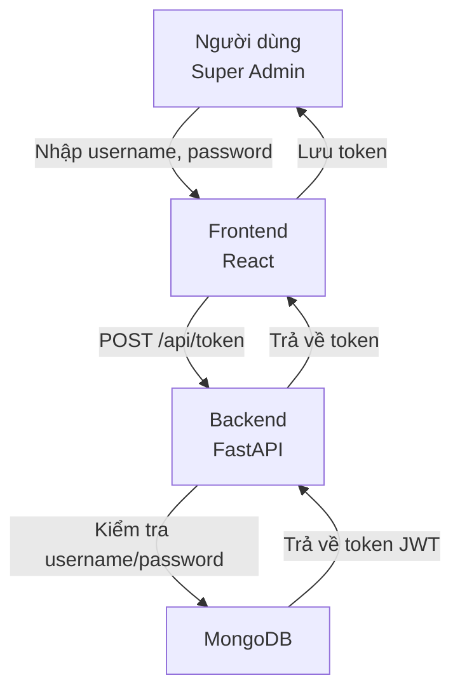

```mermaid
graph TD
    A[Người dùng <br> Super Admin] -->|Nhập username, password| B[Frontend <br> React]
    B -->|POST /api/token| C[Backend <br> FastAPI]
    C -->|Kiểm tra username/password| D[MongoDB]
    D -->|Trả về token JWT| C
    C -->|Trả về token| B
    B -->|Lưu token| A
```