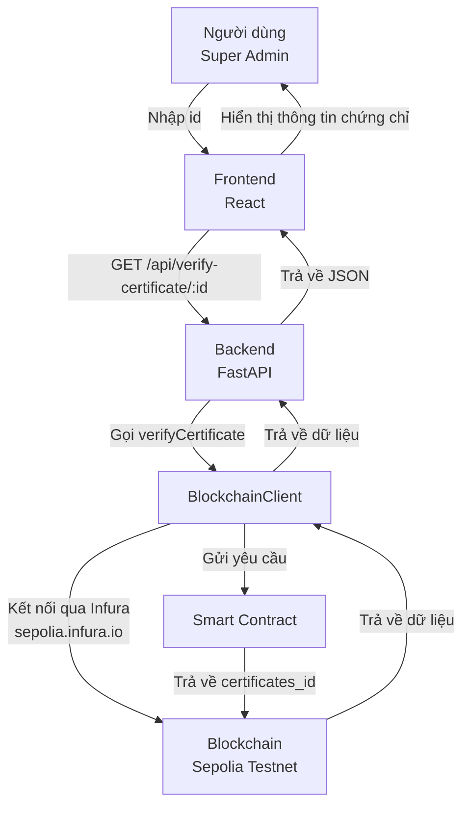

```mermaid
graph TD
    A[Người dùng <br> Super Admin] -->|Nhập id| B[Frontend <br> React]
    B -->|GET /api/verify-certificate/:id| C[Backend <br> FastAPI]
    C -->|Gọi verifyCertificate| E[BlockchainClient]
    E -->|Kết nối qua Infura <br> sepolia.infura.io| I[Blockchain <br> Sepolia Testnet]
    E -->|Gửi yêu cầu| H[Smart Contract]
    H -->|Trả về certificates_id| I
    I -->|Trả về dữ liệu| E
    E -->|Trả về dữ liệu| C
    C -->|Trả về JSON| B
    B -->|Hiển thị thông tin chứng chỉ| A
```